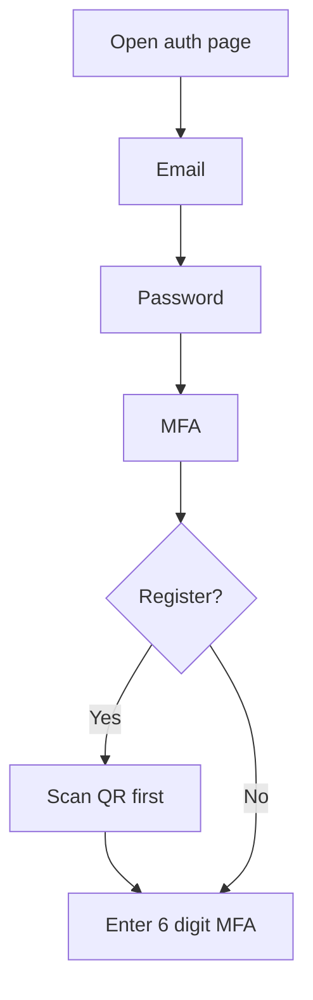
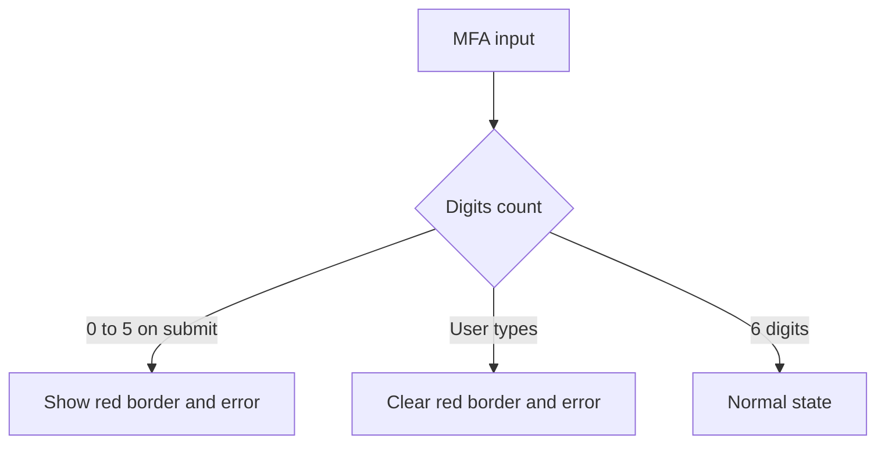

# 365Biz Auth Design Rules

> Scope: `/login` and `/register`
>
> Goal: Keep the auth pages clean, calm, Notion-like, and consistent.

## Design Direction

| Rule | Decision |
|---|---|
| Visual style | Quiet product UI, not marketing hero |
| Main reference | Notion auth style from `DESIGN-notion.md` |
| Page mood | White, minimal, focused |
| Accent use | Blue only for primary action, focus, selected state, and hover links |
| Shape | Small rounded rectangles, not pill-heavy |
| Motion | Only for state reveal, loading, dropdown arrow, and MFA counter |

## Layout

| Element | Rule |
|---|---|
| Page | Full viewport, centered both ways |
| Main content width | `380px` max |
| Page padding | `24px` horizontal, `40px` vertical |
| Header spacing | `36px` below title block |
| Field spacing | `20px` between progressive fields |
| Button spacing | `24px` above Continue |
| Divider spacing | `24px` above, `20px` below |
| Language selector | Fixed bottom center, close to bottom |

## Colors

| Token | Color | Use |
|---|---|---|
| Background | `#ffffff` | Page canvas |
| Primary text | `#000000` | Main title, button text on white |
| Secondary text | `#31302e` | Labels, dropdown item main text |
| Muted text | `#615d59` | Helper copy, language control |
| Soft text | `#8f8983` | Subtitle, dropdown descriptions |
| Faint text | `#a39e98` | Placeholder, divider text, legal text |
| Hairline | `#e6e6e6` | Input border, button border, divider |
| Soft hover | `#f6f5f4` | Google hover, language hover, dropdown option hover |
| Primary blue | `#0075de` | Continue button, focus border, selected check, hover links |
| Primary hover | `#0b83ea` | Continue hover |
| Primary pressed | `#005bab` | Stronger blue reference only |
| Focus ring | `#62aef0` at low opacity | Focus state |
| Error red | `#d92d20` | Error border and error text |

## Typography

| Element | Size | Weight | Line Height | Color |
|---|---:|---:|---:|---|
| Main title | `24px` | `600` | `1.23` | `#000000` |
| Subtitle | `22px` | `600` | `1.23` | `#8f8983` |
| Label | `15px` | `500` | `20px` | `#31302e` |
| Input text | `15px` | `400` | Default | `#000000` |
| Helper text | `13px` max | `400` | `20px` | `#615d59` |
| Button text | `16px` | `600` | Default | White |
| Google button text | `15px` | `500` | Default | `#000000` |
| Legal text | `12px` | `400` | `20px` | `#a39e98` |
| Language text | `14px` | `400` | Default | `#615d59` |
| Dropdown main text | `14px` | `400` | `20px` | `#31302e` |
| Dropdown subtext | `12px` | `400` | `16px` | `#8f8983` |

## Font Rules

| Language | Font Rule |
|---|---|
| English | Use the app sans stack from Geist, Apple system, Segoe UI |
| Chinese | Prefer `PingFang SC`, then Microsoft YaHei UI, Microsoft YaHei, Noto Sans CJK SC |
| Mixed text | Keep normal weight; avoid overly bold Chinese |
| Letter spacing | Keep neutral; only Chinese dropdown label may use a tiny positive tracking |

## Form Controls

| Control | Rule |
|---|---|
| Input height | `44px` |
| Input radius | `8px` |
| Input border | `1px #e6e6e6` |
| Input padding | `16px` horizontal |
| MFA input right padding | Enough room for the counter |
| Placeholder | `#a39e98` |
| Focus border | `#0075de` |
| Focus ring | Soft blue ring, low opacity |
| Error border | `#d92d20` |
| Error text | `13px`, red, `8px` below input |

## Button Rules

| Button | Rule |
|---|---|
| Continue height | `44px` |
| Continue radius | `8px` |
| Continue background | `#0075de` |
| Continue hover | `#0b83ea` |
| Continue disabled/loading | `#62aef0` |
| Continue shadow | Very light blue shadow |
| Loading spinner | Right side, small, white stroke |
| Google button | White background, hairline border, light grey hover |
| QR scanned button | White, hairline border, light grey hover |

## Validation Rules

| Field | Error Trigger | Recovery |
|---|---|---|
| Email | Empty on submit | User starts typing |
| Email | Invalid email format on submit | User starts typing |
| Password | Empty on submit | User starts typing |
| MFA | Less than 6 digits on submit | User starts typing |
| MFA | Non-numeric input | Automatically removed |
| MFA | More than 6 digits | Automatically trimmed to 6 |

## MFA Rules

| Area | Rule |
|---|---|
| MFA length | Exactly 6 digits |
| Counter | Shows remaining digits from `6` to `0` |
| Counter position | Vertically aligned to the input only |
| Counter color | `#a39e98` |
| Counter animation | Fade in and slight upward movement on change |
| Error layout | Error text must not affect counter position |
| Register MFA | QR Code appears before MFA input |
| Login MFA | MFA input appears directly after Password step |

## Register QR Rules

| Element | Rule |
|---|---|
| QR container | White surface, hairline border, 8px radius |
| QR size | `132px` square |
| QR visual | Black modules on white |
| QR helper text | Centered, muted, `13px` |
| Scan confirmation | User clicks `I have scanned` before MFA input appears |

## Language Selector

| Element | Rule |
|---|---|
| Position | Fixed bottom center |
| Height | Compact, `32px` active area |
| Text | `Language:` plus selected language |
| Icon | Globe on the left |
| Arrow | Chevron on the right |
| Arrow animation | Rotate up when open, down when closed |
| Menu width | `220px` |
| Menu surface | White, hairline border, light shadow |
| Menu option | Two-line label |
| Selected option | Blue check icon |
| Hover | Light grey background with internal padding |

## Legal Links

| State | Rule |
|---|---|
| Default | Same grey as legal text |
| Underline | Grey underline, close to text |
| Hover | Blue text and blue underline |
| Weight | Normal, not medium |

## Motion

| Motion | Duration | Purpose |
|---|---:|---|
| Progressive field reveal | `180ms` | Show next step |
| MFA counter change | `160ms` | Make count change visible |
| Language arrow | `180ms` | Reflect dropdown state |
| Button loading | `650ms` simulated | Show transition to next step |

## Do

| Do | Why |
|---|---|
| Keep all auth controls at the same height | Makes the page feel stable |
| Keep blue reserved for actions and focus | Prevents visual noise |
| Keep errors red and direct | Users understand what to fix |
| Keep QR inside the MFA step only | Registration MFA setup needs scan first |
| Keep `/login` and `/register` visually identical | Same product, same trust level |

## Do Not

| Do Not | Reason |
|---|---|
| Do not use large cards around the whole form | The current design should feel integrated |
| Do not use heavy black hover borders | It feels harsh and unlike Notion |
| Do not use native select styling | The language control is custom |
| Do not make MFA counter align to the whole error block | It causes vertical drift |
| Do not keep error visible while the user is typing | It feels broken |
| Do not use decorative colors for main actions | Blue is the only structural accent |

