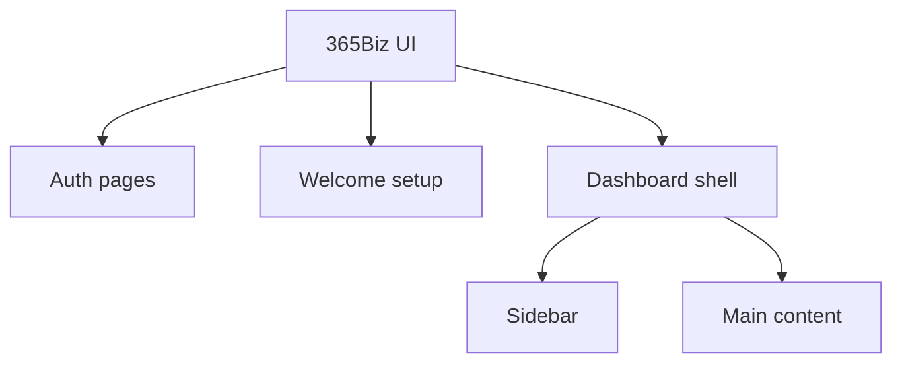

# 365Biz Design Rules

> Scope: `/login`, `/register`, `/welcome`, `/purchase-invoice`, shared sidebar, and future dashboard pages.
>
> Goal: Keep the product clean, calm, rounded, fast, and consistent. The visual direction is Notion-like with Linear-style sidebar density and Apple HIG interaction discipline.

## Design Direction

| Rule | Decision |
|---|---|
| Main mood | Clean, quiet, product-focused |
| Main references | `DESIGN-notion.md`, `Linaer.md`, Apple HIG ideas |
| Product feel | Minimal, soft, responsive, not decorative |
| UI density | Auth pages are spacious; dashboard sidebar is compact |
| Accent usage | Blue is for primary action, selected brand mark, focus, and important action links |
| Shape language | Soft rounded rectangles and squircle marks |
| Motion style | Small, fast, and purposeful |

## Global Font Rules

| Area | Rule |
|---|---|
| Primary font | Use `Inter` from `next/font/google` |
| CSS token | `--font-inter` |
| Tailwind sans | `--font-sans: var(--font-inter)` |
| English fallback | `-apple-system`, `BlinkMacSystemFont`, `Arial`, `Helvetica`, `sans-serif` |
| Chinese fallback | `PingFang SC`, `Microsoft YaHei UI`, `Microsoft YaHei`, `Noto Sans CJK SC` |
| Rendering | Use antialiasing, optical sizing, no synthetic font |
| Font weight | Prefer `400`, `500`, `600`; avoid heavy bold |
| Letter spacing | Keep neutral; only initials may use tight tracking |

## Global Colors

| Token | Color | Use |
|---|---|---|
| Page background | `#ffffff` | Main page canvas |
| Sidebar background | `#f7f7f8` | Dashboard sidebar |
| Sidebar divider | `rgba(0,0,0,0.055)` | Sidebar right separation |
| Primary text | `#000000` | High emphasis text |
| Dashboard selected text | `#2c2c2b` | Selected sidebar text |
| Dashboard normal text | `#5f5e59` | Normal sidebar text |
| Muted icon | `#6f6a64` | Unselected sidebar icons |
| Soft text | `#8f8983` | Metadata and helper text |
| Faint text | `#a39e98` | Placeholder and legal copy |
| Hairline | `#e6e6e6` | Border and divider |
| Warm divider | `#dedbd7` | Dropdown section divider |
| Soft hover | `#ededee` | Sidebar hover |
| Auth soft hover | `#f6f5f4` | Auth controls and dropdown hover |
| Selected surface | `#e9e9ea` | Sidebar selected item |
| Selected hover | `#e3e3e4` | Active quick nav hover |
| Primary blue | `#0075de` | Main action and brand mark |
| Primary blue hover | `#0b83ea` | Continue button hover |
| Error red | `#d92d20` | Validation error |
| Tooltip bg | `#2c2c2b` | Custom tooltip |
| Tooltip shortcut | `#a8a8a5` | Tooltip shortcut text |

## Shape Rules

| Element | Radius |
|---|---:|
| Auth input | `8px` |
| Auth primary button | `8px` |
| Sidebar nav item | `8px` |
| Sidebar category row | `7px` |
| Small menu button | `6px` |
| Dropdown surface | `11px` |
| Company avatar | `10px` squircle |
| Quick nav pill | Full pill |
| Tooltip | `8px` |

## Dashboard Sidebar

| Rule | Decision |
|---|---|
| Component file | `src/components/sidebar.tsx` |
| Width | `320px` on desktop |
| Background | `#f7f7f8` |
| Divider | Inset right shadow, not a harsh line |
| Padding | `12px` |
| Font | Inter, `14px` |
| Normal text | `#5f5e59` |
| Active text | `#2c2c2b` |
| Normal icon | `#6f6a64` |
| Active icon | `#2c2c2b` |
| Hover | `#ededee`, no black border |
| Focus | Soft ring only, no browser-blue visual style |
| Cursor | Buttons must use pointer cursor |

## Sidebar Header

| Element | Rule |
|---|---|
| Company selector | `32px` height |
| Company avatar | Squircle, `24px`, blue or soft gradient depending context |
| Company name | `14px`, `500`, `#2c2c2b` |
| Gap | Compact but not stuck |
| Chevron | Right side, muted grey |
| Dropdown | Opens below header with small motion |

## Company Avatar

| Rule | Decision |
|---|---|
| Shape | Rounded squircle, not circle |
| Header size | `24px` |
| Dropdown list size | `15px` |
| Dropdown detail size | `24px` |
| Text | Company initials |
| Text weight | `600` |
| Tracking | Slight tight tracking |
| Preferred style | Soft color, rounded, clean |

## Sidebar Quick Navigation

| Item | Display |
|---|---|
| Home | Icon + text when active |
| Chat | Icon + text when active |
| Manage | Icon + text when active |
| Search | Icon only, pushed to far right |

| Rule | Decision |
|---|---|
| Row height | `32px` |
| Active item | Pill surface `#e9e9ea` |
| Inactive item | `32px` icon button |
| Active text | Only active item shows text |
| Chat visible label | `Chat` |
| Chat tooltip | `Chat with Amate` |
| Manage icon | Do not use gear; use a tray/inbox style icon |
| Search | Does not participate in active state |
| Animation | Use the earlier simple transition version unless changed intentionally |

## Sidebar Categories

| Rule | Decision |
|---|---|
| Category style | Small, Linear-like row |
| Category height | `24px` |
| Category font | `14px`, `500` |
| Category color | `#5f5e59` |
| Category icon | Small chevron |
| Collapse | Category rows are collapsible |
| Spacing between groups | About `12px` |

## Sidebar Items

| Rule | Decision |
|---|---|
| Row height | `28px` |
| Font size | `14px` |
| Font weight | `500` |
| Icon size | `15px` |
| Icon stroke | Around `1.85` |
| Item gap | `8px` |
| Active bg | `#e9e9ea` |
| Hover bg | `#ededee` |
| Normal text | `#5f5e59` |
| Active text | `#2c2c2b` |
| Normal icon | `#6f6a64` |
| Active icon | `#2c2c2b` |

## Sidebar Navigation Structure

| Category | Items |
|---|---|
| Cashbook | Cashbook |
| Accounts payable | APInvoice, Purchase invoice, APPayment, Good Receive note |
| Accounts receivable | Sales invoice, ARPayment, Sales order |
| Service | Joborder (management), Joborder (employee) |
| Report | Cashflow report, Salesreport |

## Icon Rules

| Rule | Decision |
|---|---|
| Icon library | `lucide-react` |
| Style | Thin linear icons |
| Default color | Grey, not colorful |
| Active color | Same as selected text |
| Hover color | Darker grey, matching selected text |
| Invoice icons | Avoid using identical icons for every invoice type |
| Report icons | Keep grey unless a future page explicitly needs color |
| Gear icon | Do not use for `Manage` quick nav |

## Custom Tooltip

| Rule | Decision |
|---|---|
| Tooltip type | Custom tooltip, not browser `title` |
| Background | `#2c2c2b` |
| Text | White |
| Shortcut text | `#a8a8a5` |
| Font size | `12px` |
| Radius | `8px` |
| Padding | Compact horizontal padding |
| Shadow | Soft dark shadow |
| Delay | Immediate or near immediate |
| Placement | Below the icon |

| Tooltip | Shortcut |
|---|---|
| Home | `H` |
| Chat with Amate | `Ctrl/Control + Alt + C` |
| Manage | `Ctrl/Control + Alt + M` |
| Search | `Ctrl/Control + K` |

## Auth Layout

| Element | Rule |
|---|---|
| Page | Full viewport, centered both ways |
| Main content width | `380px` max |
| Page padding | `24px` horizontal, `40px` vertical |
| Header spacing | `36px` below title block |
| Field spacing | `20px` between progressive fields |
| Button spacing | `24px` above Continue |
| Divider spacing | `24px` above, `20px` below |
| Language selector | Fixed bottom center |

## Auth Typography

| Element | Size | Weight | Line Height | Color |
|---|---:|---:|---:|---|
| Main title | `24px` | `600` | `1.23` | `#000000` |
| Subtitle | `22px` | `600` | `1.23` | `#8f8983` |
| Label | `15px` | `500` | `20px` | `#31302e` |
| Input text | `15px` | `400` | Default | `#000000` |
| Helper text | `13px` max | `400` | `20px` | `#615d59` |
| Button text | `16px` | `600` | Default | White |
| Google button text | `15px` | `500` | Default | `#000000` |
| Legal text | `12px` | `400` | `20px` | `#a39e98` |
| Language text | `14px` | `400` | Default | `#615d59` |
| Dropdown main text | `14px` | `400` | `20px` | `#31302e` |
| Dropdown subtext | `12px` | `400` | `16px` | `#8f8983` |

## Auth Form Controls

| Control | Rule |
|---|---|
| Input height | `44px` |
| Input radius | `8px` |
| Input border | `1px #e6e6e6` |
| Input padding | `16px` horizontal |
| Placeholder | `#a39e98` |
| Focus border | `#0075de` |
| Focus ring | Soft blue ring, low opacity |
| Error border | `#d92d20` |
| Error text | `13px`, red, `8px` below input |

## Auth Button Rules

| Button | Rule |
|---|---|
| Continue height | `44px` |
| Continue radius | `8px` |
| Continue background | `#0075de` |
| Continue hover | `#0b83ea` |
| Continue disabled/loading | `#62aef0` |
| Loading spinner | Right side, small, white stroke |
| Google button | White background, hairline border, light grey hover |
| QR scanned button | White, hairline border, light grey hover |

## Validation Rules

| Field | Error Trigger | Recovery |
|---|---|---|
| Email | Empty on submit | User starts typing |
| Email | Invalid email format on submit | User starts typing |
| Password | Empty on submit | User starts typing |
| MFA | Less than 6 digits on submit | User starts typing |
| MFA | Non-numeric input | Automatically removed |
| MFA | More than 6 digits | Automatically trimmed to 6 |

## MFA Rules

| Area | Rule |
|---|---|
| MFA length | Exactly 6 digits |
| Counter | Shows remaining digits from `6` to `0` |
| Counter position | Vertically aligned to the input only |
| Counter color | `#a39e98` |
| Counter animation | Fade in and slight upward movement on change |
| Error layout | Error text must not affect counter position |
| Register MFA | QR Code appears before MFA input |
| Login MFA | MFA input appears directly after Password step |

## Register QR Rules

| Element | Rule |
|---|---|
| QR container | White surface, hairline border, 8px radius |
| QR size | `132px` square |
| QR visual | Black modules on white |
| QR helper text | Centered, muted, `13px` |
| Scan confirmation | User clicks `I have scanned` before MFA input appears |

## Language Selector

| Element | Rule |
|---|---|
| Position | Fixed bottom center |
| Height | Compact, `32px` active area |
| Text | `Language:` plus selected language |
| Icon | Globe on the left |
| Arrow | Chevron on the right |
| Arrow animation | Rotate up when open, down when closed |
| Menu width | `220px` |
| Menu surface | White, hairline border, light shadow |
| Menu option | Two-line label |
| Selected option | Blue check icon |
| Hover | Light grey background with internal padding |

## Legal Links

| State | Rule |
|---|---|
| Default | Same grey as legal text |
| Underline | Grey underline, close to text |
| Hover | Blue text and blue underline |
| Weight | Normal, not medium |

## Motion

| Motion | Duration | Purpose |
|---|---:|---|
| Sidebar hover | `75ms` | Make hover feel responsive |
| Quick nav switch | `150ms` | Compact active-state change |
| Dropdown open | `220ms` | Smooth but restrained |
| Dropdown item stagger | `160ms` | Slight entry polish |
| Progressive field reveal | `180ms` | Show next auth step |
| MFA counter change | `160ms` | Make count change visible |
| Language arrow | `180ms` | Reflect dropdown state |
| Button loading | `650ms` simulated | Show transition to next step |

## Accessibility

| Rule | Decision |
|---|---|
| Buttons | Must use pointer cursor |
| Disabled | Must use not-allowed cursor |
| Focus | Use subtle focus-visible ring |
| Native title | Avoid for designed tooltip areas |
| Reduced motion | Disable non-essential animation |
| Icon buttons | Must have `aria-label` |
| Active nav | Use `aria-current="page"` where relevant |

## Do

| Do | Why |
|---|---|
| Use Inter for product UI | Keeps sidebar rounder and cleaner |
| Keep dashboard sidebar compact | Feels more like Linear |
| Keep hover light and quick | Makes UI feel responsive |
| Keep icons grey by default | Avoids visual noise |
| Keep blue reserved | Maintains clear action hierarchy |
| Keep auth pages stable and centered | Builds trust |
| Use custom tooltip when shortcuts matter | Better than browser native tooltip |

## Do Not

| Do Not | Reason |
|---|---|
| Do not use heavy black hover borders | Too harsh |
| Do not use native select styling | Looks inconsistent |
| Do not use gear for quick `Manage` | Feels like settings, not module management |
| Do not make every sidebar icon colorful | Too noisy |
| Do not make sidebar rows too tall | Loses Linear-like density |
| Do not over-animate quick nav | It should feel fast, not playful |
| Do not keep errors visible while user types | Feels broken |

## Dashboard Adaptive Fit

| Rule | Decision |
|---|---|
| Scope | Dashboard pages only |
| Do not use | CSS `zoom`, `transform: scale()`, or global `html font-size` for desktop fit |
| Use instead | Dashboard CSS variables for sidebar width, content padding, row height, table columns, and drawer width |
| Small laptop | Sidebar should narrow first, then table columns and drawer width should compact |
| Auth pages | Login, register, and welcome stay independent from dashboard density |
| Table fit | Keep important columns visible before relying on horizontal scrolling |
| Drawer fit | Drawer width should depend on available space after sidebar, not fixed only |
| Breakpoints | Support 1440x900, 1536x960, 1920x1200, and larger desktop without manual browser zoom |

